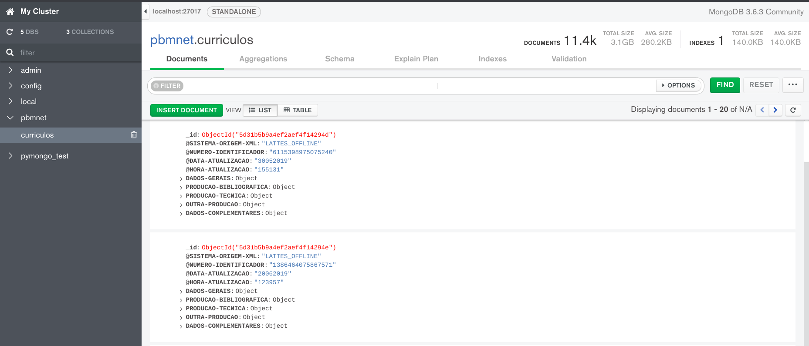

# PBMNet - Analysing the Brazilian Network of Mathematics Research
## Final Project for Class Fundamentos de Data Science - FGV

## Team:
* Davi Sales Barreira
* Franklin Oliveira

## Overview:
The Curriculum Lattes is a cv of the academic activities of
students and researchers of Brazil. Stored at Plataforma Lattes, 
this cv format is adopted by most academic institutions and research centers
of Brazil, therefore, constituting a rich siurce of information to study
the academic production of the country.

At Plataforma Lattes, the researchers inform their area of study, making
it possible to analyze the data by research area.

In this project, we analyze the data for the researchers in mathematics.
We also obtained and analyzed the researchers with areas listed as 
computer science, probability and statistics, since we consider them
to be part of mathematics as a whole.

## Objective:
Our aim is to get an overall understanding of how is the research network
of mathematics of the researches in Plataforma Lattes. For that we:

* Extract some fundamental statistics regarding the research in mathematics,
such as total number of researchers, total number of publications,
average number of publication per researcher.

* Generate a co-authorship network and study the properties of such network,
as the number of edges, degree distribution, number of connected components,
average shortest path.

## MOTIVATION:
We are Brazilian math students, do we need to say more?! Learning about the mathematics research network, questions such who are the researchers that publish the most, how is research evolving over time, do mathematicians in the network collaborate among themselves, what is their degrees of separation...

## REPOSITORY:

### 1) [Example_Data_Scraping](Example_Data_Scraping.ipynb)
This is an example of the method we used to extract the cvs from Plataforma Lattes. The whole extraction takes more
than a day.

### 2) [Create_DB_in_Mongo](Create_DB_in_Mongo.ipynb)
The name is self-explanatory, this notebook 
contains the code used to extract each .xml raw file, convert it to json and then insert in a Mongo database, which
was then used to query information and create dataframes.

### 3) [Dataframe_from_Mongo](Dataframe_from_Mongo.ipynb)
This notebook contains the code for doing the queries in MongoDB and create the Dataframes used in the other
notebooks. The two dataframes used were Authors.csv and Papers.csv.
### 4) [Exploring_Database](Exploring_Database.ipynb)
Here is where the exploratory analysis of both Authors and Papers dataframes were explored. From this analysis,
several of our motivating questions were answered.
### 5) [Create_Network](Create_Network.ipynb )
In this notebook the co-authorship network is created and explored. First the network as a whole is studied,
then, after learning about the existence of a giant connected component, this giant component is explored
by it self. The two main libraries used are networkx and graph-tool, with the last one being used mainly
to generate the visualizations due to it having a much better performance than networkx.

## Running the code:
If you want to run this code in your own computer, you must rename the
folder sample_data to dados, or update the file location in the
*Create_DB_in_Mongo* notebook.
In the file *requirements.txt* there are some non-standard libraries
that you will need in order to run the notebook. We left out the more
standard ones, such as numpy and matplolib. In case of running into missing
libraries, just install them. If you encounter some problem with version
compatibility, just contact us and we will provide the versions that were
used.

Other than Python libraries, one needs to install both Graph-Tool and MongoDB. We also suggest installing MongoDB Compass, a free GUI for MongoDB.

## Graph-Tool:
In this repository, to create the images of the co-authorship networks
and estimate some parameters of the network, we used
[**graph-tool**](https://graph-tool.skewed.de/), a library for efficient
graph analysis. Note that this library uses C++ to do the heavy lifting,
therefore it needs to be compiled before using (which can take up to 4 hours).
The installation steps are present in the official website for the library.

## ABOUT THE DATA:
Plataforma Lattes is a public platform owned by the Brazilian government and is freely available to anyone who has the patience to go through the CAPTCHA and collect it. The raw cv's were in .xml format and were turned into json through python, thus feeding a MongoDB database. Using MonogoDB, we created two main dataframes, one with information regarding the researchers and another one related to the published papers.

The cv's collected were the ones marked by the platform as relating researchers from mathematics, computer science and probability & statistics. The total number of documents collected were 11.424, but some of them did not exist anymore by the time we collected them (or were missing for some reason).

